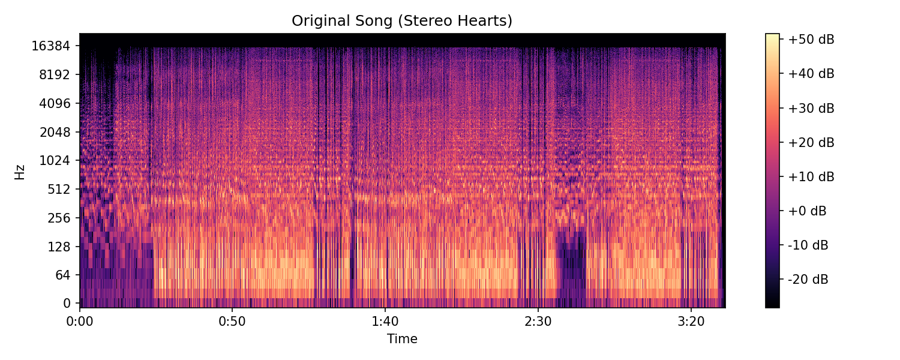
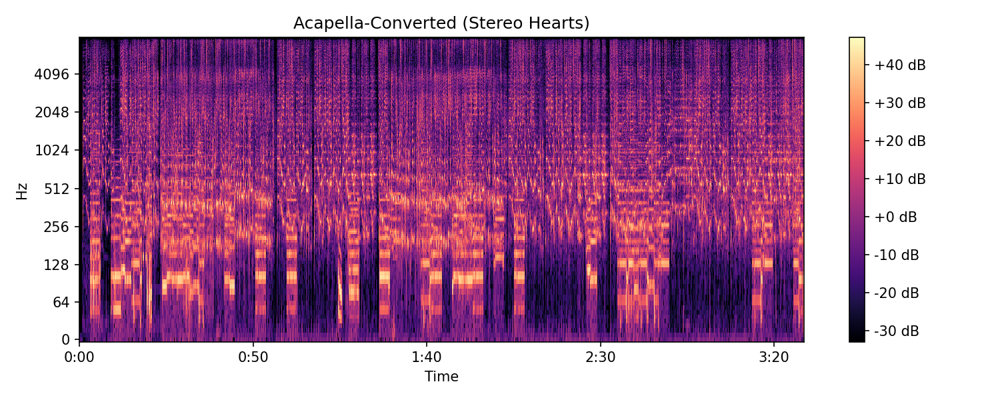

# Acapella-Powered Song Recaster


Recreate any song using only mouth-made sounds through an end-to-end modular audio pipeline.

## Why?
I’ve always been a huge fan of acapella, and I wondered: **is it possible to recreate any song using only mouth-made sounds?** Well this project answers that question. 

## Pipeline
This project builds a pipeline that:

1. **Ingests** hundreds of acapella “instrumental” tracks  
2. **Slices** them into short segments  
3. **Embeds** each slice with a pretrained audio model  
4. **Indexes** those embeddings with FAISS  
5. **Converts** any input song by matching its instrumental sections to your acapella library, time-stretching and stitching together a brand-new acapella “instrumental,” then layering back the original vocals


## Features

- **Modular pipeline**: clear separation of data ingestion, embedding, matching, synthesis, and orchestration  
- **Pretrained embeddings**: uses Wav2Vec2 for robust audio features  
- **Fast nearest-neighbor search** with FAISS  
- **Time-stretching & cross-fade assembly** to avoid pops and align durations  
- **CLI tools** for ingestion, index building/updating, and conversion  

---
## Repo Structure
```
audiorecast/
├── README.md
├── pyproject.toml
├── src/
│   └── audiorecast/
│       ├── data/
│       │   ├── downloader.py           # YouTube → WAV
│       │   ├── stem_splitter.py        # Demucs wrapper & 4→2 stem merge
│       │   └── segmenter.py            # Chop stems into fixed windows
│       ├── embedding/
│       │   └── extractor.py            # Wav2Vec2 feature extractor
│       ├── matching/
│       │   ├── index_builder.py        # Build embeddings.npy + FAISS index
│       │   └── matcher.py              # Query FAISS for top-k matches
│       ├── synthesis/
│       │   ├── synthesizer.py          # Time-stretch pads slices
│       │   └── assembler.py            # Cross-fade & concatenate
│       └── pipeline.py                 # End-to-end conversion logic
├── scripts/
│   ├── ingest_acapellas.py             # Download, split, slice
│   ├── build_faiss_index.py            # Full rebuild
│   └── convert_song.py                 # Given input → acapella-style output
└── data/
    ├── ingest/                         # .txt playlists of YouTube URLs
    ├── raw/                            # Downloaded WAVs + stems + slices
    └── embeddings/                     # embeddings.npy, paths.jsonl, .faiss

```

## Demo

**Input Song**: 🎧 `Stereo_Hearts_acapella.mp3`  
**Output (acapella-recast)**: 🎤 `Stereo_Hearts_acapella.wav`

Spectrogram comparison:




Obviously, the results aren’t perfect, yet. With a larger acapella database, better matching heuristics (re-ranking matches with cosine similarity + timing loss), and future improvements in synthesis, the output quality will significantly improve.

This is just the starting point, there's a lot of exciting room to grow.

## Docker Support

You can run this project directly via Docker:

**Build locally**:
```bash
docker build -t audiorecast .
```

## Installation Instructions
### Clone the repo
```bash
git clone https://github.com/Codingisinmyblud/audiorecast.git && cd audiorecast
```
### Install Dependencies

1. Install Poetry (if you don't have it yet):  
   [https://python-poetry.org/docs/#installation](https://python-poetry.org/docs/#installation)

2. Install project dependencies:  
```bash
poetry install
```
## Tech Stack
### Built With
- Python 3.12
- [FAISS](https://github.com/facebookresearch/faiss)
- [Wav2Vec2](https://huggingface.co/facebook/wav2vec2-base)
- [Demucs](https://github.com/facebookresearch/demucs)

## Future Improvements

This project is just the beginning. Here are some directions I plan to explore:

- Expand the acapella database for more diverse sounds
- Improve matching using music-specific audio embeddings (e.g. CLAP or MERT)
- Add beat-aware slicing and better tempo alignment (dynamic time warping, etc.)
- Explore smarter re-ranking (combine cosine similarity with timing constraints)
- Speed up pipeline using multiprocessing or batch inference
- Build a web interface for real-time previews and remixing

Have more ideas? Open an issue or PR, contributions are welcome!


## Contributing
Pull requests welcome. For major changes, open an issue first.

1. Fork the repo
2. Create your feature branch (`git checkout -b feature/foo`)
3. Commit your changes (`git commit -m 'Add foo'`)
4. Push and create a PR

## License
This project is licensed under the MIT License. See `LICENSE` for more info.
